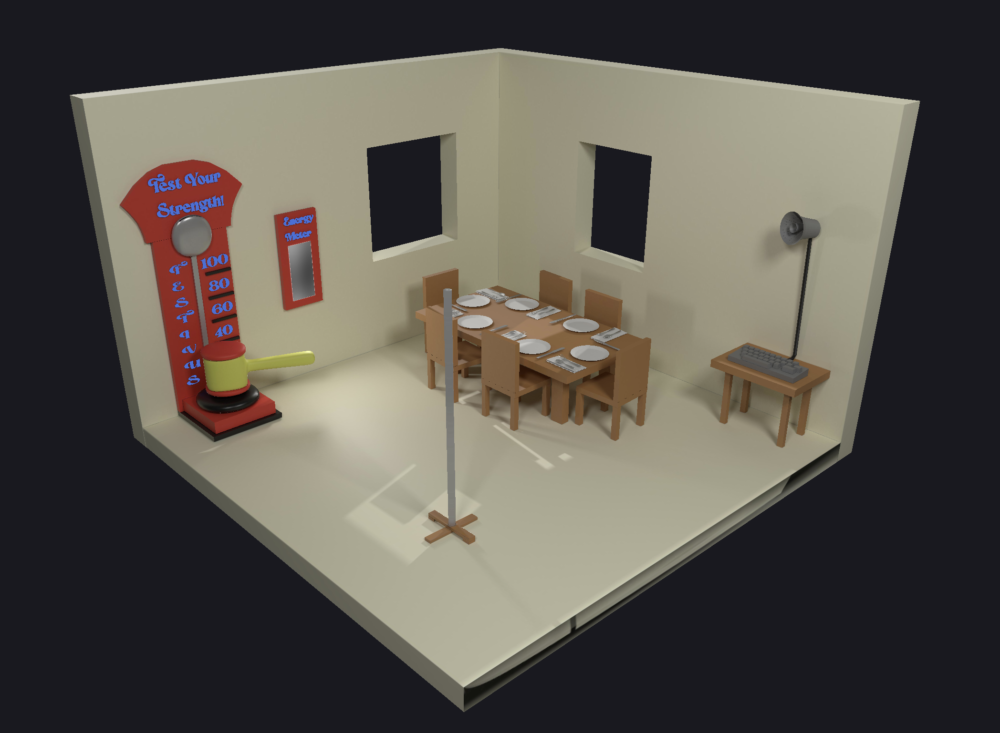

# isometric-festivus-room

A festivus themed room for Bruno Simon's Three.js Journey Isometric Room Challenge.

Deployed Link: https://isometric-festivus-room.vercel.app/

## Table of Contents

1. [Project Description](#project-description)
2. [Technologies Used](#technologies-used)
3. [Demo](#demo)
4. [How to Install and Run this Project](#how-to-install-and-run-this-project)
5. [Future Enhancements](#future-enhancements)

# Project Description

The room has four main features. First, there’s a carnival style test your strength game, to represent feats of strength. Second, there’s the traditional festivus aluminum pole that spins on click. Third, there’s a PA system for airing your grievances! Finally, there is the Festivus dinner table, which is not interactive at this time.

What is Festivus? See here: https://festivusweb.com/

# Technologies Used

- 
- 
- 
- 
- 
- 
- 
- 

# How to install and run this project

1. Clone the repo to your computer in your desired folder

`git clone git@github.com:meadDashSolomon/isometric-festivus-room.git`

2. Install all dependencies by running

`npm install`

3. It's time to start your development server and vite server! Run

`npm run dev`

in your command line, and check out the project at localhost:5173 in your browser. Have fun!
